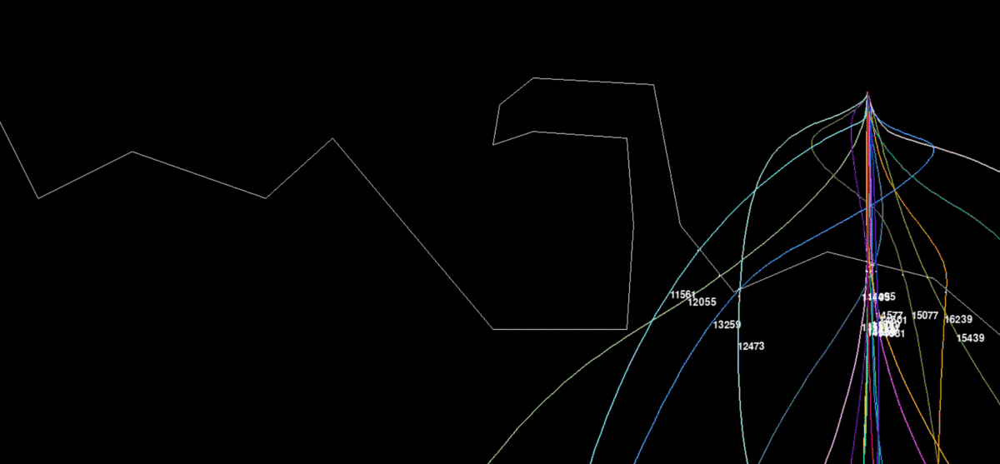
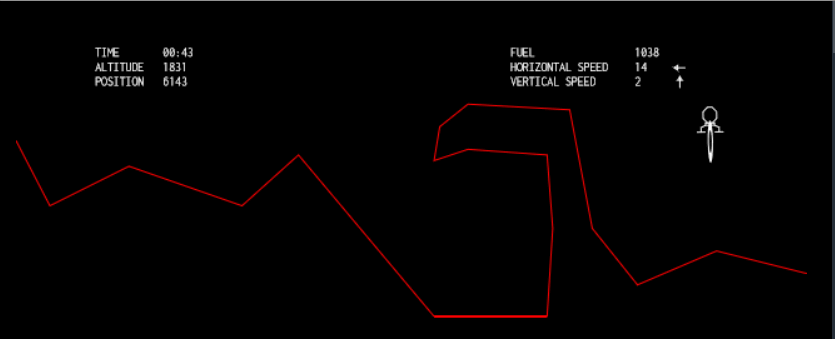

# mars-lander

An attempt to solve mars lander through genetic algorithm and sine and cosine sum series (i.e. an(sin(nx)+bn(cos(nx))) \
The challenge is inspired by a puzzle on condingame <https://www.codingame.com/ide/puzzle/mars-lander-episode-3>  

The algorithm uses a set of randomly chosen parameters as coefficients to the sine cosine sum series.

The generated function is then used to output the "power" and the "angle" for the lander.
Several such sets of parameters are selected and the best ones are kept while discarding the bad choices. Then answer is improved upon by  procedure similar to that of genetic algorithm.
 

 
In working on the codingame site mentioned above

